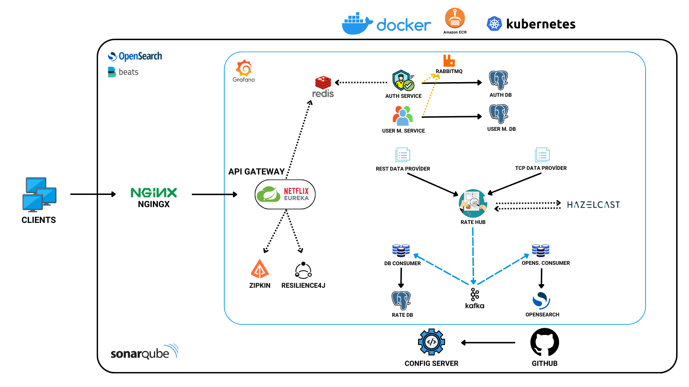

# Rate Distribution

## Project Description

Rate Distribution, a microservice-based application consisting of two data-supplying platforms and a main application that processes 
this data, was developed.

## Project Architecture



<br>

## Table of Contents

- [Technologies Used](#technologies-used)
- [Features](#features)
- [Getting Started](#getting-started)
- [Services](#services)
- [Roles & Users](#roles--users)
- [Authentication & Authorization](#authentication--authorization)
- [Endpoints](#endpoints)
- [Request Body Examples](#request-body-examples)
- [Opensearch](#opensearch)
- [Grafana](#grafana)
- [SonarQube](#sonarqube)
- [Get in Touch](#-get-in-touch)

<br>

## Technologies Used

<table>
  <tr>
    <td>
        <ul>
          <li>Java 21</li>
          <li>Spring Boot</li>
          <li>Spring Security</li>
          <li>PostgreSQL</li>
          <li>Java JWT</li>
          <li>Docker</li>
          <li>Spring Cloud</li>
          <li>Netflix Eureka</li>
          <li>Web Client</li>
          <li>Redis</li>
          <li>Hazelcast</li>
          <li>JUnit 5</li>
          <li>JUnit Suite Engine</li>
          <li>JaCoCo</li>
          <li>Filebeat</li>
        </ul>
    </td>
    <td>
        <ul>
          <li>Log4j2</li>
          <li>Opensearch</li>
          <li>Micrometer</li>
          <li>Zipkin</li>
          <li>Resilience4J</li>
          <li>RabbitMQ</li>
          <li>Kafka</li>
          <li>JavaMailSender</li>
          <li>Prometheus</li>
          <li>Grafana</li>
          <li>SonarQube</li>
          <li>Kubernetes</li>
          <li>AWS</li>
          <li>NGINX</li>
        </ul>
    </td>
  </tr>
</table>

<br>

## Features

<table>
  <tr>
    <td>
        <ul>
          <li>Token & Role Based Authentication & Authorization</li>
          <li>Microservices</li>
          <li>API Gateway</li>
          <li>Config Server</li>
          <li>Load Balancing</li>
          <li>Token Storing</li>
          <li>Caching</li>
          <li>Message Queueing</li>
          <li>Asynchronous Messaging</li>
          <li>Circuit Breaking</li>
        </ul>
    </td>
    <td>
        <ul>
          <li>Web Client</li>
          <li>Centralized Logging</li>
          <li>Reverse Proxy</li>
          <li>Distributed Tracing System</li>
          <li>Soft Deletion</li>
          <li>Pagination, Filtering & Sorting</li>
          <li>Unit Testing</li>
          <li>Email Sending</li>
          <li>Static Code Analysis</li>
          <li>Data Visualization</li>
        </ul>
    </td>
  </tr>
</table>

<br>

## Getting Started

### Prerequisites

Ensure you have the following installed:

- Java 21
- Maven
- Docker

### Usage

To **start** all services defined in docker-compose.yml, use the following command:

```bash
docker-compose up -d
```

To **stop** all running services, use:

```bash
docker-compose down
```